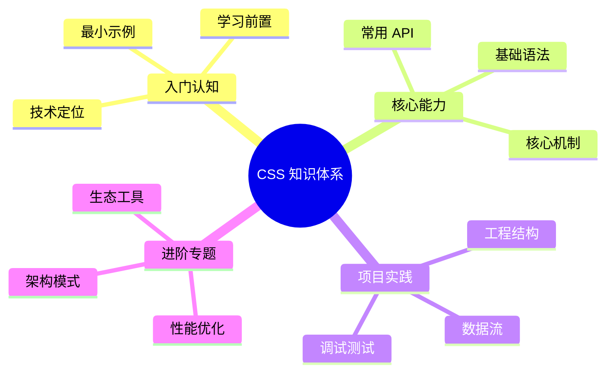

# CSS 知识体系导读



本系列文档以 [roadmap.sh CSS 路线图](https://roadmap.sh/css) 为骨架，**Tailwind CSS 4 为现代化对照基线**。每章按"原生 CSS 写法 ↔ Tailwind 等价类"双栏组织，目标是让读者既理解底层机制，又能上手主流工程实践。

阅读对象为已具备 HTML 基础的前端开发者。预处理器（Sass / PostCSS）与 CSS-in-JS 的工程实践集中在 [工程化](/css/methodologies)。

## 章节结构

| 章节 | 主题 | 关键知识点 |
| ---- | ---- | ---------- |
| 1 | [简介与心智模型](/css/introduction) | 三种引入方式、级联与继承、特异性算法 |
| 2 | [选择器](/css/selectors) | 简单 / 组合 / 属性选择器、`:where` / `:is` / `:has` |
| 3 | [文字与排版](/css/text-typography) | 字体栈、字号、行距、字间距、可变字体 |
| 4 | [颜色与背景](/css/colors-backgrounds) | 颜色模型、渐变、`color-mix`、`light-dark` |
| 5 | [盒模型](/css/box-model) | `box-sizing`、margin 折叠、`outline` vs `border` |
| 6 | [单位与函数](/css/units-functions) | 绝对 / 相对单位、`calc` / `clamp` / `min` / `max` |
| 7 | [显示与定位](/css/display-position) | `display`、`position`、层叠上下文 |
| 8 | [伪类与伪元素](/css/pseudo) | `:hover` / `:nth-*` / `:has` / `::before` / `::backdrop` |
| 9 | [Flexbox](/css/flexbox) | 主轴 / 交叉轴、对齐、`gap`、常见布局模式 |
| 10 | [Grid](/css/grid) | 网格线、显式 / 隐式、Subgrid、`grid-template-areas` |
| 11 | [其他布局](/css/layouts-other) | 流式、浮动、多列、`object-fit`、滤镜 |
| 12 | [响应式](/css/responsive) | Media Queries、Container Queries、Fluid Typography |
| 13 | [过渡与动画](/css/transitions-animations) | `transition` / `transform` / `@keyframes` / 性能 |
| 14 | [CSS 变量与现代函数](/css/variables-functions) | 自定义属性、`@property`、`color-mix` |
| 15 | [工程化](/css/methodologies) | BEM、Sass、PostCSS、CSS Modules、CSS-in-JS |
| 16 | [最佳实践](/css/best-practices) | 性能（layout / paint / composite）、无障碍、调试 |

## Tailwind 对照模式

每个知识点会以如下模式对照：

````md
### 原生 CSS

```css
.title {
  font-size: 1.5rem;
  line-height: 2rem;
}
```

### Tailwind

```html
<h1 class="text-2xl">...</h1>
```

`text-2xl` 同时设定 `font-size` 与 `line-height`。
````

并标注**何时不用 Tailwind 等价**——动态值、响应曲线、复杂选择器等场景仍以原生 CSS 为优。

## 排版约定

- 长属性使用块格式，简写形式仅在常用别名 / 速记处出现
- 关键示例使用文件名标注：

  ```css filename="styles/button.css"
  .button { /* ... */ }
  ```

- 浏览器兼容性以 [caniuse.com](https://caniuse.com) 当前数据为参考
- Tailwind 4 新特性首次出现时显式标注（如 CSS-first 配置、`@theme`、`@utility`、容器查询单位）

## 起点

请从 [简介与心智模型](/css/introduction) 开始。
