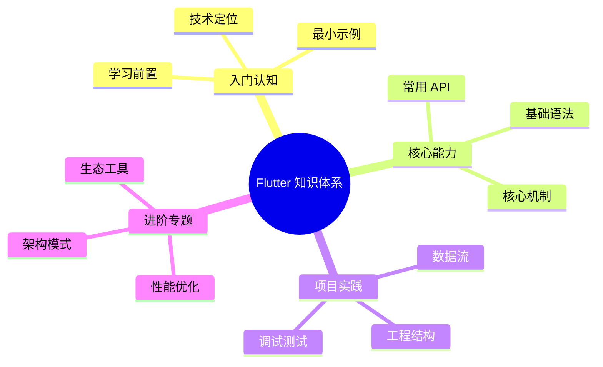

# Flutter 知识体系导读



本系列文档以 [roadmap.sh Flutter 路线图](https://roadmap.sh/flutter) 为骨架展开，**Flutter 3.x + Dart 3.x 为基线**，覆盖从语言层、Widget 体系、渲染内核到工程化与跨平台分发的完整路径。

阅读对象：**没有 Flutter / Dart 经验，但具备至少一门面向对象语言基础（Java、C#、TypeScript、Kotlin、Swift 任意）**。每个新概念会从"它是什么、为什么需要它、最小可运行示例、常见陷阱"四个角度展开，不假设读者已经接触过任何相关库或框架。

Dart 3 的新语法（`records`、`patterns`、`sealed`、class modifiers）与 Flutter 3 的新内核（Impeller）会在出现处显式标注版本。

## 章节结构

| 章节 | 主题 | 关键知识点 |
| ---- | ---- | ---------- |
| 1 | [简介与心智模型](/flutter/introduction) | Flutter 是什么、声明式 UI、一切皆 Widget、三棵树预览、运行时模型 |
| 2 | [Dart 基础](/flutter/dart-basics) | 变量、内置类型、函数、运算符、控制流、null safety、类与构造函数 |
| 3 | [Dart 类系统](/flutter/dart-oop) | 继承、`mixin`、`abstract`、`sealed` / `final` / `base` / `interface` 修饰符、records、patterns、扩展 |
| 4 | [Dart 集合与函数式](/flutter/dart-functional) | List / Set / Map、迭代器、Lambda、泛型、`Iterable` API、扩展方法 |
| 5 | [Dart 异步与并发](/flutter/dart-async) | Future、Stream、async / await、错误传播、Isolate、SendPort |
| 6 | [工具链](/flutter/tooling) | Flutter CLI、FVM、IDE 插件、pub.dev、flavors、目录约定 |
| 7 | [Widgets 基础](/flutter/widgets-basics) | Stateless / Stateful / Inherited、生命周期、`BuildContext`、Keys |
| 8 | [Material 3 与 Cupertino](/flutter/widgets-material) | M3 设计令牌、Scaffold / AppBar / Card / Button 系列、Cupertino 对照 |
| 9 | [布局、约束与主题](/flutter/layout-styling) | 约束系统（Constraints down, sizes up）、Flex / Stack、Theme、Assets / Fonts |
| 10 | [渲染机制](/flutter/rendering) | Widget / Element / RenderObject 三棵树、`BuildContext`、Impeller |
| 11 | [路由与导航](/flutter/navigation) | Navigator 1.0 / 2.0、Router API、go_router、auto_route、deep link |
| 12 | [状态管理](/flutter/state-management) | setState / InheritedWidget / Provider / **Riverpod** / **Bloc** / GetX |
| 13 | [响应式编程](/flutter/reactive) | Stream 全家桶、StreamBuilder、RxDart、与状态管理的协作 |
| 14 | [数据请求](/flutter/networking) | http、dio、REST、GraphQL、WebSocket、JSON 序列化（freezed） |
| 15 | [持久化](/flutter/storage) | SharedPreferences、sqflite、Drift、Hive、Isar、secure_storage |
| 16 | [Firebase 与 BaaS](/flutter/firebase) | Auth、Firestore、Storage、FCM、Remote Config、Cloud Functions |
| 17 | [表单与校验](/flutter/forms) | Form / FormField、formz、reactive_forms、焦点与键盘 |
| 18 | [动画](/flutter/animation) | 隐式 / 显式、AnimationController、Tween、Curve、Hero、Rive / Lottie |
| 19 | [设计原则与架构](/flutter/design-principles) | OOP、SOLID、DI（get_it / Riverpod）、Clean Architecture、Repository |
| 20 | [测试](/flutter/testing) | unit / widget / integration / golden、mocktail、TDD、BDD |
| 21 | [调试与性能](/flutter/devtools-perf) | Inspector、DevTools、Memory、Timeline、Profile mode、常见性能陷阱 |
| 22 | [CI/CD 与发布](/flutter/ci-cd-deploy) | Fastlane、Codemagic、Bitrise、GitHub Actions、AppStore / Play Store |
| 23 | [埋点与监控](/flutter/analytics) | Firebase Analytics、GA4、Segment、Mixpanel、Crashlytics、Sentry |
| 24 | [平台集成](/flutter/platform-integration) | Platform Channels、Pigeon、FFI、Web / Desktop、插件开发 |

## 排版约定

- API 签名使用 Dart 形式呈现，例如：

  ```dart
  Future<T> compute<Q, T>(
    ComputeCallback<Q, T> callback,
    Q message, {
    String? debugLabel,
  })
  ```

- 关键示例使用文件名标注：

  ```dart filename="lib/main.dart"
  // ...
  ```

- 反直觉行为单列「陷阱」小节，给出"为什么"+"如何修"。
- 涉及 Dart 3 新增语法（`records`、`patterns`、`sealed class`、class modifiers）或 Flutter 3 新内核（Impeller）时显式标注版本。
- 每章末尾配「心智模型清单」与「自查问题」，便于复盘。

## 阅读建议

- **完全零基础**：从第 1 章顺读到第 10 章；前 5 章打 Dart 语言地基，6–10 章打 Flutter 渲染地基，跳章会留下盲点。
- **想先动手**：第 1 章 → 第 6 章（工具链）→ 第 7 章（Widgets 基础）→ 跑通 hello world，再回头补 Dart。
- **专项查阅**：每章独立可读，章首列出"前置依赖章节"。

## 起点

请从 [简介与心智模型](/flutter/introduction) 开始。
