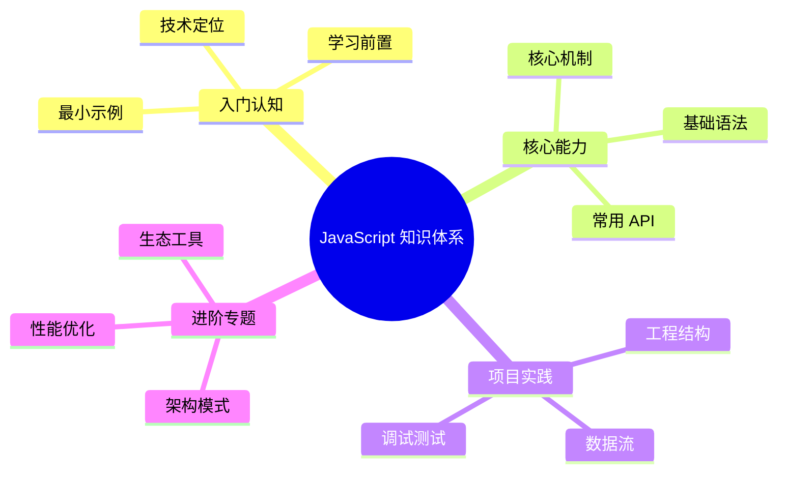

# JavaScript 知识体系导读

本系列文档以 [roadmap.sh JavaScript 路线图](https://roadmap.sh/javascript) 为骨架，按依赖关系自顶向下组织 JavaScript 语言核心知识点。每一章配有可运行的代码示例与执行结果剖析，目标读者为已具备基础编程经验、希望系统化梳理 JavaScript 语言机制的开发者。

## 章节结构

| 章节 | 主题 | 关键知识点 |
| ---- | ---- | ---------- |
| 1 | [语言介绍](/js/introduction) | 语言定位、历史、ECMAScript 版本演进、运行环境 |
| 2 | [变量](/js/variables) | `var` / `let` / `const`、提升、作用域、TDZ |
| 3 | [数据类型](/js/data-types) | 七种原始类型、对象、原型链、`typeof` |
| 4 | [类型转换](/js/type-casting) | `ToPrimitive` / `ToNumber` / `ToString`、隐式与显式 |
| 5 | [数据结构](/js/data-structures) | `Array` / `Map` / `Set` / `WeakMap` / TypedArray、JSON |
| 6 | [相等性比较](/js/equality) | `==` / `===` / `Object.is`、四种等值算法 |
| 7 | [表达式与运算符](/js/operators) | 算术 / 比较 / 逻辑 / 位 / 赋值 / 字符串运算符 |
| 8 | [控制流](/js/control-flow) | `if` / `switch`、异常处理、`Error` 体系 |
| 9 | [循环与迭代](/js/loops) | `for` / `while` / `for...of` / `for...in`、`break` / `continue` |
| 10 | [函数](/js/functions) | 参数模式、箭头函数、IIFE、闭包、词法作用域、递归 |
| 11 | [this 关键字](/js/this) | 五种绑定规则、`call` / `apply` / `bind` |
| 12 | [异步](/js/async) | 事件循环、宏/微任务、`Promise`、`async/await`、Fetch |
| 13 | [模块](/js/modules) | CommonJS、ES Modules、互操作 |
| 14 | [迭代器、类与 API](/js/iterators-classes) | 迭代协议、生成器、`class`、网络请求 API |
| 15 | [内存管理](/js/memory) | 内存生命周期、可达性、垃圾回收策略 |
| 16 | [开发者工具](/js/devtools) | 断点调试、内存泄漏定位、性能剖析 |
| 17 | [严格模式](/js/strict-mode) | 启用方式、语义差异 |

## 阅读建议

- **先线性、后跳跃**。第 1–6 章构成语法核心，建议按顺序通读；第 10、11、12 章是中高级面试与日常开发的高频区，可重复研读。
- **配合规范**。文中涉及"为什么这样设计"的问题时，会引用 [ECMA-262](https://tc39.es/ecma262/) 中相应的抽象操作（如 `ToPrimitive`、`OrdinaryGet`），以便读者深入到规范层面验证行为。
- **示例可复制**。所有代码块均可直接粘贴到浏览器控制台或 Node.js REPL 执行；涉及环境差异时会显式标注。

## 排版约定

- ECMAScript 规范术语首次出现时使用 `code` 体并保留英文，如 `Reference Record`、`Lexical Environment`。
- 行内 ECMAScript 版本以缩写表示：ES5（2009）、ES6 / ES2015、ES2017、ES2020 等。
- 输出值的注释紧跟语句之后，例如 `// → 42`，便于核对执行结果。

## 起点

请从 [语言介绍](/js/introduction) 开始。
