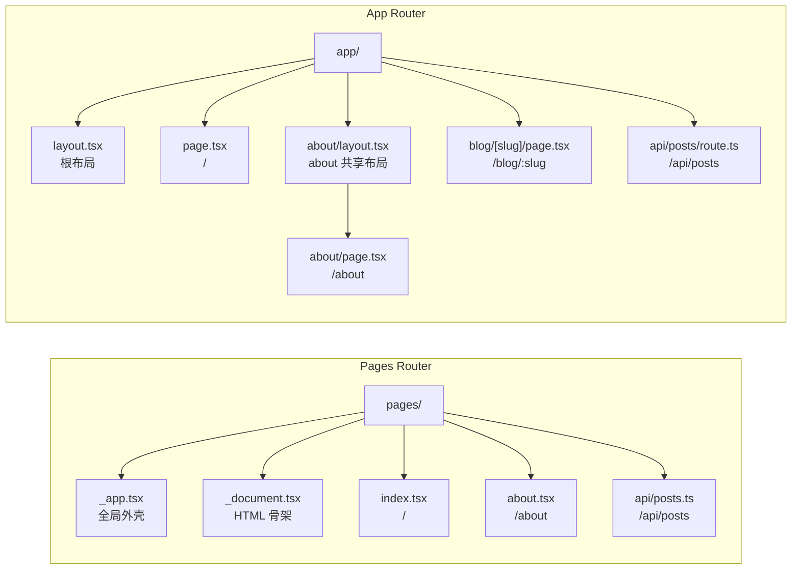
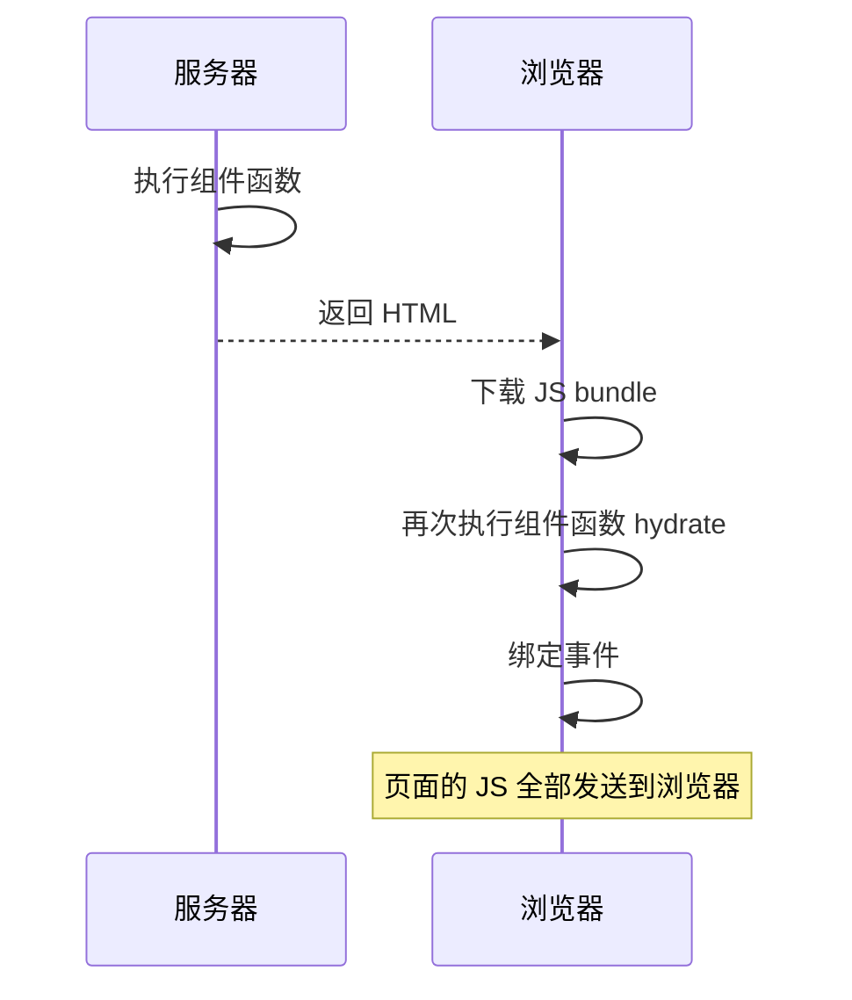
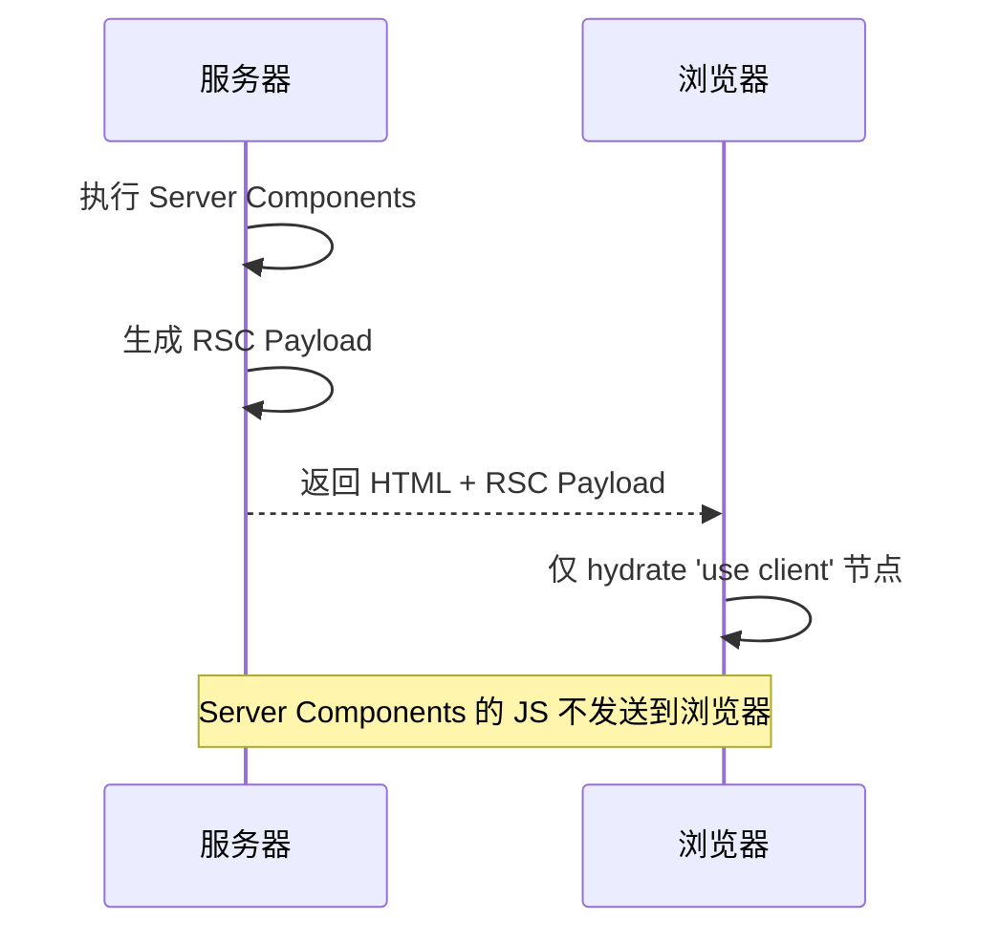
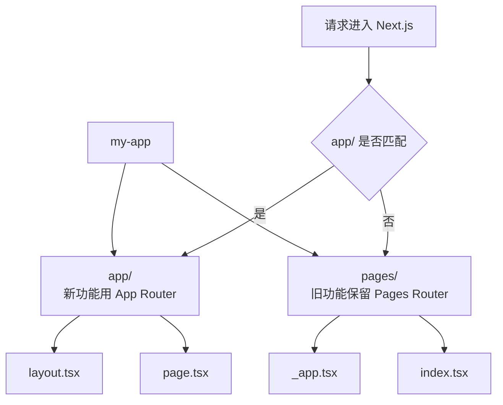

# App Router vs Pages Router

Next.js 同时支持两套路由系统。**新项目默认使用 App Router**，本系列文档也以 App Router 为基线。

## 核心差异

| 维度 | Pages Router | App Router |
| ---- | ------------ | ---------- |
| 目录 | `pages/` | `app/` |
| 路由定义 | 文件名即路由（含 API Routes） | `page.tsx` + `layout.tsx` 分层 |
| 布局 | `_app.tsx` + `_document.tsx`（全局） | 嵌套 `layout.tsx`（按路由段） |
| 数据获取 | `getServerSideProps` / `getStaticProps` / `getStaticPaths` | async 组件 + `generateStaticParams` |
| 渲染模型 | 全客户端组件 + SSR hydrate | 默认 Server Components，`'use client'` 边界 |
| 流式渲染 | 不支持 | Suspense + `loading.tsx` 原生支持 |
| Server Actions | 不支持 | `'use server'` 表单/副作用 |
| API 层 | `pages/api/*` | `route.ts` (Route Handlers) |
| Middleware | 单文件 `middleware.ts` | 单文件 `middleware.ts`（两者共享） |
| Metadata | `<Head>` 组件 | `generateMetadata` / `metadata` 导出 |
| 构建速度 | Webpack | Turbopack（Next.js 16 默认） |
| 并行路由 | 不支持 | `@slot` 目录 |
| 拦截路由 | 不支持 | `(.)` / `(..)` 语法 |

## 目录结构对比



## 渲染模型详解

### Pages Router: "全部组件在客户端运行"



### App Router: "默认是 Server，按需 Client"



这意味着 App Router 中：
- 只做数据展示的组件 **不发送 JS 包到浏览器**
- 大型 npm 依赖放在 Server Component 中 → 用户永远不下载
- 只有 `onClick`、`useState`、`useEffect` 之类的交互代码被 bundle

## 迁移策略

### 渐进迁移（推荐）

两个路由系统可以**共存**在同一个项目：



Next.js 的路由匹配顺序：
1. App Router 优先匹配 `app/`
2. 如果 `app/` 没有匹配，回退到 `pages/`

这意味着你可以逐页迁移。

### 迁移清单

| 要迁移的 | Pages Router API | App Router 等价 |
| -------- | ---------------- | --------------- |
| 路由页面 | `pages/xxx.tsx` | `app/xxx/page.tsx` |
| 共享布局 | `_app.tsx` | `app/layout.tsx` |
| 服务端数据 | `getServerSideProps` | async 函数体 |
| 静态数据 | `getStaticProps` | `generateStaticParams` + async |
| 路径参数 | `getStaticPaths` | `generateStaticParams` |
| API 端点 | `pages/api/*.ts` | `app/api/*/route.ts` |
| Head | `<Head>` | `generateMetadata` / `metadata` |
| 页面级错误 | `_error.tsx` | `error.tsx` |
| 页面级加载 | 手动 Suspense | `loading.tsx` |
| 环境变量 | `process.env.X` | `process.env.X`（相同） |

### 常见迁移坑

#### `useRouter` 来源不同

```tsx
// Pages Router
import { useRouter } from 'next/router'

// App Router
import { useRouter } from 'next/navigation'
```

API 有明显差异：App Router 的 `useRouter` 不暴露 `query` 对象（改用 `useSearchParams`）。

#### Image 组件差异

```tsx
// Pages Router — 可选 import
import Image from 'next/image'

// App Router — 同样 import，但部分 props 不同
import Image from 'next/image'
```

App Router 的 `<Image>` 不要求 `width` / `height` 在远程图片时（需先配置 `remotePatterns`）。

#### `pages/_document.tsx` 不复存在

App Router 的 `<html>` / `<body>` 直接在 `app/layout.tsx` 中定义。没有单独的 Document 文件。

## 何时仍用 Pages Router

App Router 不是一棵树上的所有答案都有。以下场景 **仍适合 Pages Router**：

| 场景 | 原因 |
| ---- | ---- |
| 已有大规模 Pages Router 项目，迁移成本过高 | 共存即可，不强制迁移 |
| 第三方库深度依赖 `next/router` | 生态的 packages 可能未适配 |
| 团队对 RSC 心智模型不熟悉 | 降低认知负担，先稳定交付 |
| 需要 `getInitialProps`（极少见） | 唯一无法在 App Router 实现的 API |
| 使用某些不兼容的 Webpack 插件 | Turbopack 插件生态尚未覆盖所有边界 |

## 注意：`pages/` 中不要做的事

- 不要在 `pages/` 和 `app/` 之间共享组件时假设同一渲染上下文（一个是 RSC，一个不是）
- 不要在 `pages/` 组件中使用 `'use server'` 或 `'use client'` 指令——它们只在 App Router 中生效
- Middleware 是两者共享的——`middleware.ts` 中的逻辑对两套路由同时生效

## 小结

- App Router 是新项目默认选择，核心优势是 Server Components + 嵌套布局 + 原生流式渲染；
- Pages Router 仍然可用且维护，两套路由可以共存于同一项目；
- 迁移的核心将 `getServerSideProps` 逻辑上移到 async 函数体，布局上移到 `layout.tsx`；
- Pages Router 仅在兼容性 / 团队认知负担成为瓶颈时作为保留选项。
