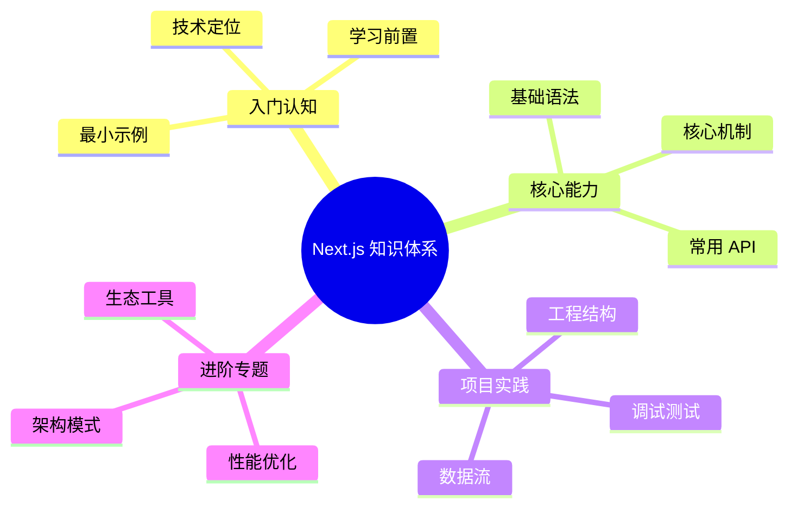

# Next.js 知识体系导读



本系列文档以 [roadmap.sh Next.js 路线图](https://roadmap.sh/nextjs) 为骨架展开，**Next.js 16 为示例基线**，覆盖从项目初始化到部署运维的完整路径。每章配有可运行的代码片段、配置示例与"何时不要用"的反推。

阅读对象为已具备 [React 核心知识](/react) 的前端工程师。App Router、Server Components、Server Actions、PPR 等较新主题会单独标注版本。

## 章节结构

| 章节 | 主题 | 关键知识点 |
| ---- | ---- | ---------- |
| 1 | [简介与优势](/nextjs/introduction) | Next.js 定位、App Router 心智模型、与纯 React 的边界 |
| 2 | [快速起步](/nextjs/getting-started) | `create-next-app`、dev / build / start 生命周期 |
| 3 | [App Router vs Pages Router](/nextjs/app-router-vs-pages) | 双路由体系差异、迁移策略、何时仍用 Pages |
| 4 | [项目结构](/nextjs/project-structure) | 文件约定、`src/` vs 根目录、私有文件夹、`@` 别名 |
| 5 | [配置体系](/nextjs/configuration) | `next.config.ts`、环境变量、TypeScript、ESLint |
| 6 | [路由基础](/nextjs/routing-basics) | `page.tsx`、`layout.tsx`、文件树即路由树 |
| 7 | [动态路由](/nextjs/dynamic-routes) | `[param]`、`[...catchAll]`、`generateStaticParams` |
| 8 | [路由组与布局](/nextjs/route-groups-layouts) | `(group)`、嵌套 layout、`template.tsx` 区别 |
| 9 | [模板、加载与错误处理](/nextjs/templates-loading-error) | `template.tsx`、`loading.tsx`、`error.tsx`、`global-error.tsx` |
| 10 | [链接与导航](/nextjs/linking-navigation) | `<Link>`、`useRouter`、`usePathname`、`redirect`、滚动恢复 |
| 11 | [并行与拦截路由](/nextjs/parallel-intercepting-routes) | `@slot`、`(.)` / `(..)` 拦截、Modal 模式 |
| 12 | [中间件](/nextjs/middleware) | `middleware.ts`、matcher、`NextRequest` / `NextResponse` |
| 13 | [服务端与客户端组件](/nextjs/server-client-components) | RSC 边界、`'use client'`、组合模式、`server-only` |
| 14 | [服务端渲染策略](/nextjs/server-side-rendering) | Static / Dynamic / Streaming、`dynamic` 配置、`unstable_noStore` |
| 15 | [ISR 与局部预渲染](/nextjs/isr-ppr) | `revalidate`、`generateStaticParams`、PPR、`use cache` |
| 16 | [流式渲染与 Suspense](/nextjs/streaming-suspense) | `loading.tsx`、`Suspense` 边界、选择性 hydration |
| 17 | [缓存体系](/nextjs/caching) | 请求记忆化、数据缓存、路由缓存、`staleTimes` |
| 18 | [数据获取](/nextjs/data-fetching) | Server Components 直接 fetch、`use cache`、第三方 SDK |
| 19 | [Server Actions](/nextjs/server-actions) | `'use server'`、`action=`、`useActionState`、`useOptimistic`、revalidation |
| 20 | [Route Handlers](/nextjs/route-handlers) | `route.ts`、`GET` / `POST` / `PUT` / `DELETE`、`NextRequest` |
| 21 | [数据库集成](/nextjs/database) | Prisma / Drizzle + Neon / PlanetScale、Server Components 直查 |
| 22 | [身份认证](/nextjs/authentication) | NextAuth.js (Auth.js)、session vs JWT、middleware 保护 |
| 23 | [样式方案](/nextjs/styling) | CSS Modules、Tailwind v4、`styled-jsx`、条件类名 |
| 24 | [图片与字体优化](/nextjs/images-fonts) | `next/image`、`next/font`、remote patterns、sizes |
| 25 | [脚本与静态资源](/nextjs/scripts-assets) | `next/script`、`public/`、外部资源加载策略 |
| 26 | [性能优化](/nextjs/performance) | Bundle 分析、动态导入、`useReportWebVitals`、Turbopack |
| 27 | [Metadata 与 SEO](/nextjs/metadata-seo) | `generateMetadata`、`viewport`、sitemap、robots、OG Image |
| 28 | [部署](/nextjs/deployment) | Vercel、Node.js、Docker、`standalone` 输出、环境变量 |
| 29 | [测试](/nextjs/testing) | Vitest + Testing Library、Cypress、Playwright、E2E |
| 30 | [模式与最佳实践](/nextjs/patterns-best-practices) | 数据访问层、组件分层、URL 状态、错误处理、安全 |

## 排版约定

- 配置与 API 签名使用 TypeScript 形式呈现，例如：

  ```ts
  export function generateStaticParams(): Promise<{ slug: string }[]>
  ```

- 关键示例使用文件名标注：

  ```tsx filename="app/posts/[slug]/page.tsx"
  // ...
  ```

- 反直觉行为单列"陷阱"小节，给出"为什么"+"如何修"。
- 涉及 Next.js 16 新增 API 时显式标注（如 `use cache`、PPR stable、Turbopack 默认开启）。

## 起点

请从 [简介与优势](/nextjs/introduction) 开始。
