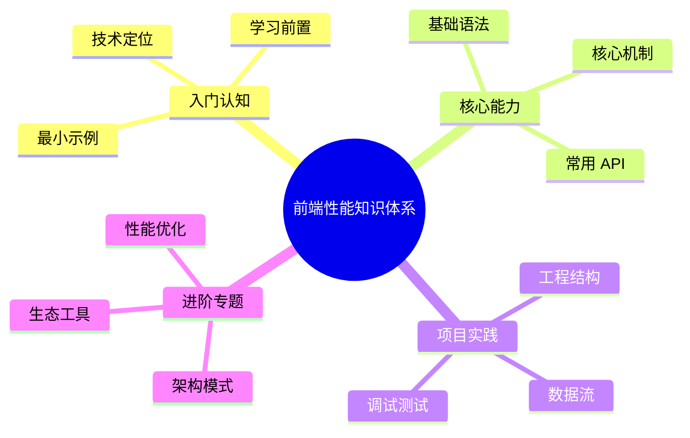

# 前端性能知识体系导读

本系列文档以 [roadmap.sh Frontend Performance 路线图](https://roadmap.sh/frontend-performance) 为骨架，按"指标 → 网络 → 资源 → 框架 → 工具"的脉络系统化梳理现代 Web 前端性能优化知识。每章配有可运行示例与实测数据，目标读者为已具备基础前端经验、希望系统化掌握性能工程的开发者。

## 章节结构

### 一、基础与衡量

| 章节 | 主题 | 关键知识点 |
| ---- | ---- | ---------- |
| 1 | [性能指标与预算](/performance/metrics) | Core Web Vitals (LCP/INP/CLS)、TTFB、FCP、TTI、性能预算 |

### 二、网络层

| 章节 | 主题 | 关键知识点 |
| ---- | ---- | ---------- |
| 2 | [网络层基础](/performance/network) | HTTP/1.1·2·3、HTTPS、请求合并、GZIP/Brotli、避免 404 |
| 3 | [CDN](/performance/cdn) | 工作原理、边缘节点、回源策略、多 CDN 容灾 |
| 4 | [缓存策略](/performance/caching) | 强缓存、协商缓存、`Cache-Control`、Service Worker |
| 5 | [资源预加载](/performance/preload) | `dns-prefetch` / `preconnect` / `preload` / `prefetch` / `fetchpriority` |

### 三、渲染资源

| 章节 | 主题 | 关键知识点 |
| ---- | ---- | ---------- |
| 6 | [HTML 优化](/performance/html) | Minify、关键渲染路径、iframes、文档结构 |
| 7 | [CSS 优化](/performance/css) | Critical CSS、非阻塞加载、Unused CSS、选择器复杂度 |
| 8 | [JavaScript 优化](/performance/javascript) | `async` / `defer`、Tree Shaking、代码分割、长任务 |

### 四、媒体与资产

| 章节 | 主题 | 关键知识点 |
| ---- | ---- | ---------- |
| 9 | [图片格式选择](/performance/image-format) | JPEG / PNG / WebP / AVIF / SVG、矢量 vs 位图、Base64 反模式 |
| 10 | [响应式图片](/performance/image-responsive) | `srcset` / `sizes` / `<picture>`、aspect ratio、CLS 防治 |
| 11 | [图片懒加载](/performance/image-lazy) | `loading="lazy"`、`IntersectionObserver`、`fetchpriority` |
| 12 | [字体优化](/performance/fonts) | WOFF2、`font-display`、子集、preconnect |
| 13 | [Cookie 性能](/performance/cookies) | 大小限制、数量控制、Domain/Path 影响 |
| 14 | [依赖管理](/performance/dependencies) | 包体积评估、Tree-shaking 友好度、Bundlephobia |

### 五、工具链

| 章节 | 主题 | 关键知识点 |
| ---- | ---- | ---------- |
| 15 | [通用性能工具链](/performance/tools) | PageSpeed Insights、Lighthouse、WebPageTest、DevTools、Squoosh |

### 六、React 性能优化（专题子目录）

进入 [React 性能优化总览](/performance/react)，覆盖：

- 渲染机制 / Fiber / 协调过程
- `React.memo` / `useMemo` / `useCallback` / React Compiler
- 状态拆分与 Context 优化
- 并发特性（`useTransition` / `useDeferredValue`）
- `Suspense` + `lazy` + 代码分割
- Server Components + Server Actions
- 渲染策略（CSR / SSR / SSG / ISR / PPR）+ 水合
- 列表虚拟化
- 动画与表单优化
- React DevTools / React Scan / Why-did-you-render
- **实战场景方案**：电商首页 / Feed 流 / Dashboard / 富文本 / 大表单 / 实时数据 / 移动端

### 七、Vue 性能优化（专题子目录）

进入 [Vue 性能优化总览](/performance/vue)，覆盖：

- 响应式系统（`Proxy` / `Ref` / `Reactive` / 调度器）
- `shallowRef` / `shallowReactive` / `readonly` / `markRaw` 优化
- `computed` / `watch` / `watchEffect` 调优
- 编译时优化（静态提升 / PatchFlag / Block Tree）
- 模板与指令（`v-once` / `v-memo` / `v-show` / `key`）
- 异步组件 + Suspense
- KeepAlive 深入
- Nuxt SSR / SSG + 水合
- 列表虚拟化
- 动画与表单优化
- Vue DevTools Timeline + 性能 API
- **实战场景方案**：电商首页 / Feed 流 / Dashboard / 富文本 / 大表单 / 实时数据 / 移动端

## 阅读建议

- **先衡量、再优化**。优化的第一步永远是测量——脱离指标谈"快"是空中楼阁。强烈建议先通读 [性能指标与预算](/performance/metrics)，理解 LCP / INP / CLS 后再进入具体章节。
- **按需深入**。第 2–5 章（网络层）是后端友好的服务端话题，第 6–11 章（资源）是日常前端高频区，[React](/performance/react) / [Vue](/performance/vue) 子目录按你的技术栈选读即可。
- **配合 DevTools 实践**。每章涉及"为什么这样优化更快"的问题时，会给出 DevTools 操作步骤，建议边读边在自己的项目上复现观察。
- **关注 P75 / P95**。性能数据有长尾分布，平均值会掩盖差用户体验。Web Vitals 默认看 P75，本系列也以此为衡量基线。

## 排版约定

- 性能术语首次出现时使用 `code` 体并保留英文，如 `Largest Contentful Paint`、`Time To First Byte`。
- 行内时间单位以毫秒为主：`200 ms`、`2.5 s`。文件大小用 KB / MB 二进制单位。
- 代码注释中标注实测数值或行为：`// → LCP 提升 ~400 ms`、`// → 4 个网络往返`。
- 浏览器特性差异通过表格注明，并以 Chrome / Firefox / Safari 为基准。

## 参考标准

- [Core Web Vitals](https://web.dev/articles/vitals) — Google 公开的用户体验度量标准
- [HTTP Archive Almanac](https://almanac.httparchive.org/) — Web 全站点的真实性能现状统计
- [WebPageTest](https://www.webpagetest.org/) — 第三方真实环境性能测试
- [MDN Performance](https://developer.mozilla.org/zh-CN/docs/Web/Performance) — 标准 API 与最佳实践

## 起点

请从 [性能指标与预算](/performance/metrics) 开始。
