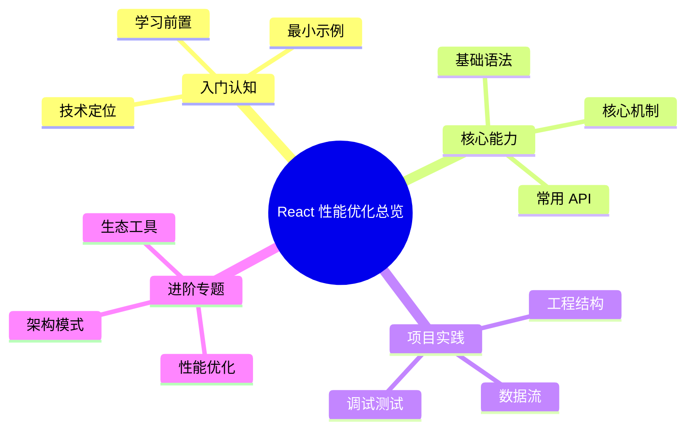

# React 性能优化总览



React 的性能模型与原生 Web 截然不同——它是**声明式**的、**组件化**的、**虚拟 DOM 驱动**的。理解 React 的性能问题，必须先理解它的渲染机制；优化 React 的性能，必须从"何时渲染、渲染什么、怎么渲染"三个维度系统下手。

本子目录覆盖 React 19+ 时代的完整性能优化体系，从底层渲染机制到上层应用模式，再到具体业务场景的实战方案。

## React 性能问题的三大类型

```text
┌─ 1. 渲染过多（Wasted Renders）────────────┐
│   - 父变 → 子全变（即使子的 props 没变）    │
│   - Context 改动一处 → 所有消费者重渲染     │
│   - 引用不稳定的 props → memo 失效          │
└─ 解决方案：memoization、状态拆分、Compiler ─┘

┌─ 2. 单次渲染慢（Slow Renders）────────────┐
│   - 大列表整页渲染                          │
│   - 复杂组件树深嵌套                         │
│   - 计算密集的 render 逻辑                  │
└─ 解决方案：虚拟化、并发特性、Code Splitting ─┘

┌─ 3. 加载慢（Slow Initial Load）──────────┐
│   - JS bundle 过大                         │
│   - 首屏 JS 解析阻塞                        │
│   - 客户端水合时间长                         │
└─ 解决方案：RSC、SSR、流式 Hydration、Lazy ─┘
```

不同类型的问题需要**不同优化路径**——不要拿到锤子就把所有问题都当钉子。

## 章节地图

### 第一层：理解渲染机制（必读基础）

| 章节 | 核心问题 | 解答 |
| ---- | -------- | ---- |
| [渲染机制与重渲染](/performance/react/rendering) | React 什么时候渲染？ | Fiber、Reconciliation、Commit Phase、四种重渲染触发条件 |

### 第二层：常规优化技术

| 章节 | 核心问题 | 解答 |
| ---- | -------- | ---- |
| [渲染优化与 Compiler](/performance/react/memoization) | 如何减少不必要的渲染？ | `memo`、`useMemo`、`useCallback`、引用稳定、React Compiler |
| [状态拆分与 Context](/performance/react/state) | 状态放哪里、Context 怎么用不卡？ | State colocation、Context 拆分、useContextSelector、Zustand/Jotai |

### 第三层：现代特性（React 18+）

| 章节 | 核心问题 | 解答 |
| ---- | -------- | ---- |
| [并发特性](/performance/react/concurrent) | 如何让大计算不阻塞输入？ | `useTransition`、`useDeferredValue`、调度优先级 |
| [Suspense 与代码分割](/performance/react/suspense-lazy) | 如何让首屏只加载必要代码？ | `lazy`、`Suspense`、路由分割、数据预取 |
| [Server Components](/performance/react/server-components) | 如何把渲染搬到服务端？ | RSC、Server Actions、`use client` / `use server`、流式 RSC |

### 第四层：渲染策略

| 章节 | 核心问题 | 解答 |
| ---- | -------- | ---- |
| [SSR / SSG / ISR / PPR](/performance/react/ssr) | 何时选哪种渲染模式？ | 五种渲染模式对比、Hydration、Selective / Progressive Hydration |

### 第五层：场景化优化

| 章节 | 核心问题 | 解答 |
| ---- | -------- | ---- |
| [列表虚拟化](/performance/react/virtualization) | 渲染 10000+ 项怎么不卡？ | react-window、react-virtuoso、TanStack Virtual |
| [动画与表单](/performance/react/animations-forms) | 动画与高频输入怎么优化？ | Framer Motion、防抖节流、受控 vs 非受控 |

### 第六层：工具链

| 章节 | 核心问题 | 解答 |
| ---- | -------- | ---- |
| [React 性能工具](/performance/react/tools) | 如何定位 React 性能问题？ | DevTools Profiler、React Scan、Why-did-you-render |

### 第七层：实战场景

| 章节 | 核心问题 | 解答 |
| ---- | -------- | ---- |
| [实战场景方案](/performance/react/case-studies) | 电商 / Feed / Dashboard / 富文本 / 实时数据各怎么优化？ | 7 类场景的整体方案 |

## React 19+ 的范式转变

R眷 19 与 React Compiler 的成熟，让 React 性能优化的"日常工作"有了显著变化：

### 旧范式（React 16-17）

```text
1. 手动 memo 化（React.memo / useMemo / useCallback）
2. 用 useReducer 替代多个 useState
3. 把 state 上提到合适层级
4. 避免内联对象 / 函数 props
5. Context 拆分
```

### 新范式（React 18-19+）

```text
1. 让 React Compiler 自动 memo 化（→ 大部分手动 memo 不再需要）
2. 用 useTransition 把"非紧急"渲染降级
3. 用 Server Components 减少客户端代码
4. 流式 Hydration 让首屏可交互更快
5. Suspense + 资源预取的协同
```

> 这并不意味着旧技术过时——它们仍是 React 性能优化的基石。Compiler 是"自动应用旧技术"的工具，不是替代。

## 快速诊断流程

```text
应用感觉卡？
│
├─ 输入卡顿（INP > 200 ms）?
│   ├─ DevTools Performance 录一段输入 ──► 找长任务
│   ├─ 输入处理是否触发大状态变化？
│   │   └─ 是 ──► useTransition / useDeferredValue
│   └─ 列表渲染太大？──► 虚拟化
│
├─ 切页慢（路由切换 > 300 ms）?
│   ├─ JS bundle 太大？──► lazy + 路由级分割
│   ├─ 数据加载阻塞？──► Suspense + 预取
│   └─ Hydration 慢？──► 流式 SSR / RSC
│
├─ 首屏 LCP 慢（> 2.5 s）?
│   ├─ 是 SPA / CSR ?──► 考虑 SSR / SSG
│   ├─ JS 太大？──► RSC / 减小 client bundle
│   └─ 关键资源没 preload ?──► 见通用预加载章节
│
└─ 滚动 / 动画卡顿（< 60 FPS）?
    ├─ 列表过长 ──► 虚拟化
    ├─ 触发了 Layout 重排 ──► 用 transform/opacity
    └─ memo 失效 ──► DevTools Profiler 找 wasted renders
```

## 阅读建议

- **顺序学习**：第一次接触 React 性能优化，建议按目录顺序（渲染 → memo → 状态 → 并发 → ...）通读，建立心理模型。
- **按问题查阅**：日常工作中遇到具体问题，直接跳到对应章节。每章末尾的"反模式清单"是高密度的速查参考。
- **搭配实战**：[实战场景方案](/performance/react/case-studies) 把前面所有技术放进具体业务上下文，建议在通读基础章节后再读，体感最好。

## 与通用章节的关系

本子目录聚焦**框架层**优化。**所有 React 项目都还需要**：

- [性能指标与预算](/performance/metrics)：所有优化都建立在测量之上
- [JavaScript 优化](/performance/javascript)：bundle 体积、Tree Shaking 适用所有项目
- [图片优化系列](/performance/image-format)：next/image 仍要懂底层规则
- [缓存策略](/performance/caching)：CDN + Service Worker 是 React 应用的基石

不要把所有性能问题都归因于 React——很多"React 慢"其实是网络慢、图片大、CSS 阻塞。

## 起点

请从 [渲染机制与重渲染](/performance/react/rendering) 开始。
