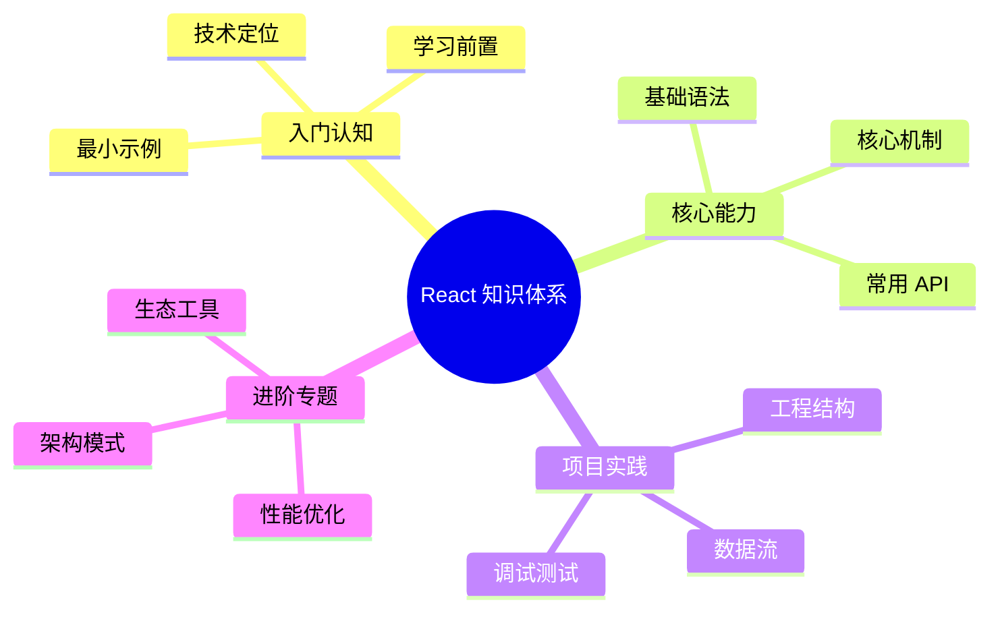

# React 知识体系导读



本系列文档以 [roadmap.sh React 路线图](https://roadmap.sh/react) 为骨架展开，**React 19 为示例基线**，覆盖从语言级心智模型到工程化生态的完整路径。每章配有可运行的代码片段、API 类型签名与"何时不要用"的反推。

阅读对象为已具备 [JavaScript 核心知识](/js) 的前端工程师。Hook、并发渲染、Server Components 等较新主题会单独标注 React 版本。

## 章节结构

| 章节 | 主题 | 关键知识点 |
| ---- | ---- | ---------- |
| 1 | [简介与心智模型](/react/introduction) | 声明式渲染、单向数据流、Reconciler、虚拟 DOM 简介 |
| 2 | [工具链](/react/tooling) | Vite + TypeScript + ESLint 项目搭建 |
| 3 | [组件](/react/components) | JSX、函数组件、Props vs State、组合、Class 组件遗留说明 |
| 4 | [渲染机制](/react/rendering) | Lists / Keys、合成事件、Refs、HOC、Render Props |
| 5 | [Hooks](/react/hooks) | 全部内置 Hook、自定义 Hook、依赖数组与闭包陷阱 |
| 6 | [状态管理](/react/state-management) | Context、Zustand、Jotai、MobX 选型 |
| 7 | [路由](/react/routing) | React Router、TanStack Router |
| 8 | [样式方案](/react/styling) | CSS Modules、Tailwind、CSS-in-JS、Headless UI |
| 9 | [数据请求](/react/api-calls) | TanStack Query、SWR、Axios、GraphQL clients |
| 10 | [表单与校验](/react/forms-validation) | React Hook Form、Formik、Zod、TS 类型联动 |
| 11 | [测试](/react/testing) | Vitest / Jest + Testing Library、Cypress、Playwright |
| 12 | [高级主题](/react/advanced) | Suspense、Error Boundary、Portals、Server Components |
| 13 | [动画](/react/animation) | Framer Motion、react-spring、GSAP |
| 14 | [框架](/react/frameworks) | Next.js（App Router）、Astro |
| 15 | [React Native](/react/react-native) | RN 心智模型与 Web 差异 |

## 排版约定

- API 签名使用 TypeScript 形式呈现，例如：

  ```ts
  function useState<S>(initial: S | (() => S)): [S, Dispatch<SetStateAction<S>>]
  ```

- 关键示例使用文件名标注：

  ```tsx filename="components/Counter.tsx"
  // ...
  ```

- 反直觉行为单列"陷阱"小节，给出"为什么"+"如何修"。
- 涉及 React 19 新增 API 时显式标注（如 `use`、`useOptimistic`、`useFormStatus`、Actions、Server Components）。

## 起点

请从 [简介与心智模型](/react/introduction) 开始。
