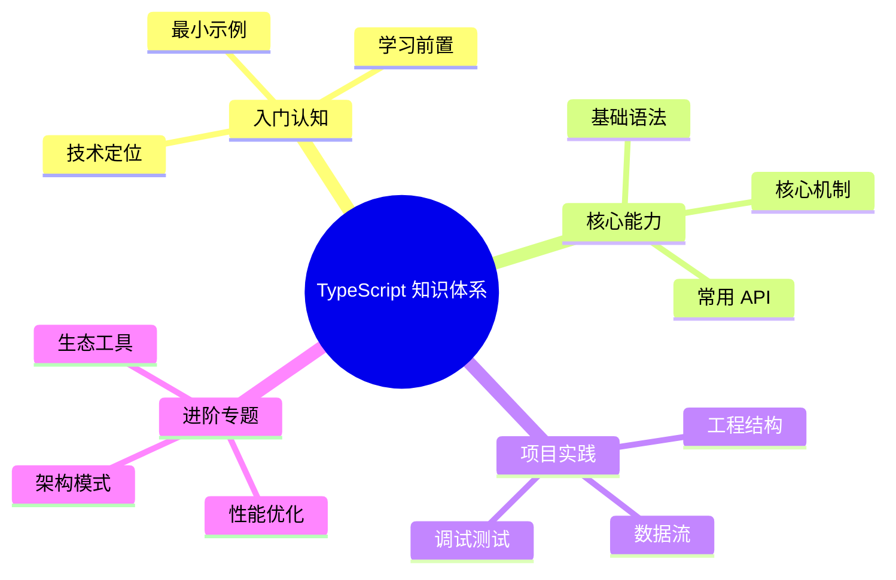

# TypeScript 知识体系导读



本系列文档以 [roadmap.sh TypeScript 路线图](https://roadmap.sh/typescript) 为骨架展开，**TypeScript 5.x 为示例基线**，结合 **React 18+** 实战应用，覆盖从基础类型到高级类型系统的完整路径。

阅读对象为已具备 [JavaScript 核心知识](/js) 和 [React 基础](/react) 的前端工程师。每章配有可运行的代码片段、类型推断演示与 React 实际应用。

## 章节结构

| 章节 | 主题 | 关键知识点 |
| ---- | ---- | ---------- |
| 1 | [简介与优势](/ts/introduction) | TypeScript 是什么、为什么使用、核心特性 |
| 2 | [TypeScript vs JavaScript](/ts/typescript-vs-javascript) | 对比分析、迁移策略、渐进式采用 |
| 3 | [安装与配置](/ts/setup) | 安装、编译器、编辑器配置、项目初始化 |
| 4 | [tsconfig.json 详解](/ts/tsconfig) | 编译选项、严格模式、路径映射、项目引用 |
| 5 | [基本类型](/ts/basic-types) | string、number、boolean、void、null、undefined、any、unknown、never |
| 6 | [对象类型](/ts/object-types) | Interface、Type、Object、Array、Tuple、Enum |
| 7 | [类型推断](/ts/type-inference) | 自动推断、最佳通用类型、上下文类型 |
| 8 | [类型兼容性](/ts/type-compatibility) | 结构化类型、协变与逆变、函数兼容性 |
| 9 | [联合与交叉类型](/ts/union-intersection) | Union Types、Intersection Types、类型组合 |
| 10 | [类型别名](/ts/type-aliases) | Type Aliases、keyof Operator、索引访问类型 |
| 11 | [类型守卫与收窄](/ts/type-guards) | typeof、instanceof、in、自定义类型守卫 |
| 12 | [接口](/ts/interfaces) | 接口声明、扩展、混合类型、接口 vs 类型别名 |
| 13 | [类](/ts/classes) | 类声明、继承、访问修饰符、抽象类、静态成员 |
| 14 | [泛型](/ts/generics) | 泛型函数、泛型类、泛型约束、泛型工具 |
| 15 | [函数类型](/ts/functions) | 函数签名、可选参数、剩余参数、函数重载 |
| 16 | [工具类型（上）](/ts/utility-types-1) | Partial、Required、Readonly、Pick、Omit |
| 17 | [工具类型（下）](/ts/utility-types-2) | Record、Exclude、Extract、NonNullable、Parameters、ReturnType |
| 18 | [映射类型](/ts/mapped-types) | 映射类型基础、键重映射、条件映射 |
| 19 | [条件类型](/ts/conditional-types) | 条件类型、分布式条件类型、infer 关键字 |
| 20 | [模板字面量类型](/ts/template-literal-types) | 字符串操作、类型推断、实际应用 |
| 21 | [装饰器](/ts/decorators) | 类装饰器、方法装饰器、属性装饰器、参数装饰器 |
| 22 | [模块系统](/ts/modules) | ES Modules、CommonJS、模块解析、声明文件 |
| 23 | [命名空间](/ts/namespaces) | 命名空间、模块增强、全局增强、三斜线指令 |
| 24 | [React + TypeScript 基础](/ts/react-typescript) | 组件类型、Props、State、事件处理 |
| 25 | [React Hooks 类型](/ts/react-hooks-typescript) | useState、useEffect、useRef、useContext、自定义 Hooks |
| 26 | [React 组件模式](/ts/react-components-typescript) | HOC、Render Props、Compound Components、泛型组件 |
| 27 | [React 高级类型](/ts/react-patterns) | 类型推断、类型守卫、高级模式 |
| 28 | [生态系统工具](/ts/ecosystem) | ESLint、Prettier、ts-node、类型检查工具 |
| 29 | [最佳实践](/ts/best-practices) | 类型设计、性能优化、常见陷阱、代码组织 |
| 30 | [实战案例](/ts/real-world) | 完整项目示例、类型设计模式、重构策略 |

## 排版约定

- 类型定义使用 TypeScript 语法：

  ```ts
  type User = {
    id: number
    name: string
  }
  ```

- React 组件示例使用 TSX：

  ```tsx filename="components/Button.tsx"
  interface ButtonProps {
    label: string
    onClick: () => void
  }
  
  export function Button({ label, onClick }: ButtonProps) {
    return <button onClick={onClick}>{label}</button>
  }
  ```

- 类型推断演示：

  ```ts
  const user = { id: 1, name: 'Alice' }
  // 推断类型：{ id: number; name: string }
  ```

- 反直觉行为单列"陷阱"小节
- TypeScript 5.x 新特性会显式标注

## TypeScript 版本演进

本文档以 TypeScript 5.x 为基线，主要新特性：

| 版本 | 主要特性 |
| ---- | -------- |
| 5.0 | Decorators、const 类型参数、枚举改进 |
| 5.1 | 返回类型优化、JSX 改进 |
| 5.2 | using 声明、装饰器元数据 |
| 5.3 | Import Attributes、类型收窄改进 |
| 5.4 | NoInfer 工具类型、闭包类型推断改进 |

## 学习路径

### 初学者路径（1-11章）
1. 理解 TypeScript 基础概念
2. 掌握类型系统核心
3. 学会类型推断和类型守卫

### 进阶路径（12-20章）
1. 深入接口、类、泛型
2. 掌握工具类型
3. 理解高级类型系统

### 实战路径（21-30章）
1. 装饰器和模块系统
2. React + TypeScript 完整应用
3. 工程化和最佳实践

## 配套资源

- [TypeScript 官方文档](https://www.typescriptlang.org/docs/)
- [TypeScript Playground](https://www.typescriptlang.org/play)
- [DefinitelyTyped](https://github.com/DefinitelyTyped/DefinitelyTyped)
- [React TypeScript Cheatsheet](https://react-typescript-cheatsheet.netlify.app/)

## 起点

请从 [简介与优势](/ts/introduction) 开始。
