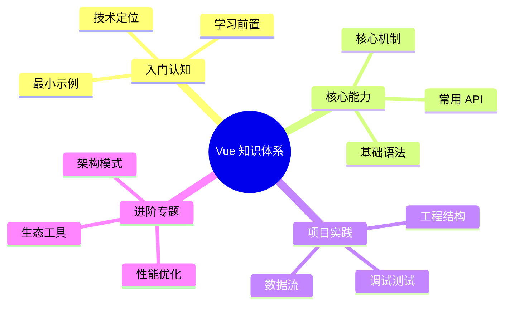

# Vue 知识体系导读



本系列文档以 [roadmap.sh Vue 路线图](https://roadmap.sh/vue) 为骨架展开，**Vue 3 为示例基线**，覆盖从响应式系统到工程化生态的完整路径。每章配有可运行的代码片段、API 类型签名与最佳实践。

阅读对象为已具备 [JavaScript 核心知识](/js) 的前端工程师。Composition API、`<script setup>`、Teleport 等 Vue 3 特性会贯穿全文。

## 章节结构

| 章节 | 主题 | 关键知识点 |
| ---- | ---- | ---------- |
| 1 | [简介与心智模型](/vue/introduction) | 响应式系统、声明式渲染、MVVM、虚拟 DOM |
| 2 | [工具链](/vue/tooling) | create-vue、Vite + TypeScript + ESLint 项目搭建 |
| 3 | [单文件组件](/vue/sfc) | SFC 结构、`<script setup>`、CSS Scoped、预处理器 |
| 4 | [模板语法与插值](/vue/template-syntax) | `{{ }}`、v-text、v-html、v-once、v-pre |
| 5 | [指令系统](/vue/directives) | v-bind、v-if/v-show、v-for、v-on、v-model |
| 6 | [组件注册与通信](/vue/components) | 全局/局部注册、Props、Events、Attribute Inheritance |
| 7 | [Props、Events、v-model](/vue/props-events) | 单向数据流、自定义事件、v-model 原理与自定义 |
| 8 | [渲染机制](/vue/rendering) | 虚拟 DOM、条件渲染、列表渲染、Key、性能优化 |
| 9 | [计算属性与侦听器](/vue/computed-watchers) | computed、watch、watchEffect、依赖追踪 |
| 10 | [API 风格](/vue/api-styles) | Options API vs Composition API 对比与选型 |
| 11 | [生命周期钩子](/vue/lifecycle) | onMounted、onUpdated、onUnmounted、组合式生命周期 |
| 12 | [事件处理](/vue/event-handling) | 事件绑定、内联/方法处理器、事件/按键/鼠标修饰符 |
| 13 | [表单处理](/vue/forms) | Input Bindings、v-model 双向绑定、修饰符 |
| 14 | [高级特性](/vue/advanced) | 异步组件、Suspense、Teleport、Provide/Inject |
| 15 | [自定义指令与插件](/vue/directives-plugins) | 指令生命周期、插件系统、全局属性 |
| 16 | [插槽系统](/vue/slots) | 默认插槽、具名插槽、作用域插槽、v-slot 语法 |
| 17 | [动画与过渡](/vue/animation) | Transition、TransitionGroup、CSS/JS 钩子 |
| 18 | [路由](/vue/routing) | Vue Router、路由守卫、懒加载、动态路由 |
| 19 | [状态管理](/vue/state-management) | Pinia、VueUse、组合式函数状态共享 |
| 20 | [样式方案](/vue/styling) | CSS Modules、Tailwind、Vuetify、Element Plus |
| 21 | [数据请求](/vue/api-calls) | Axios、fetch、TanStack Query、Apollo Client |
| 22 | [表单库与校验](/vue/forms-validation) | FormKit、Vee Validate、Vuelidate、Zod 集成 |
| 23 | [测试](/vue/testing) | Vitest + Vue Test Utils、Cypress、Playwright |
| 24 | [SSR/SSG](/vue/ssr-ssg) | Nuxt 3、VitePress、Quasar、服务端渲染原理 |
| 25 | [移动端](/vue/mobile) | Capacitor 集成、Vue Native 方案 |

## 排版约定

- API 签名使用 TypeScript 形式呈现，例如：

  ```ts
  function ref<T>(value: T): Ref<UnwrapRef<T>>
  ```

- 关键示例使用文件名标注：

  ```vue filename="components/Counter.vue"
  // ...
  ```

- 代码示例优先使用 `<script setup>` + Composition API
- 反直觉行为单列"陷阱"小节，给出"为什么"+"如何修"
- 涉及 Vue 3.3+ 新增特性时显式标注（如 `defineModel`、泛型组件）

## Vue 3 vs Vue 2

本文档以 Vue 3 为基线，不涵盖 Vue 2 特性。主要差异：

| 特性 | Vue 2 | Vue 3 |
| ---- | ----- | ----- |
| 响应式系统 | Object.defineProperty | Proxy |
| 组合逻辑 | Mixins | Composition API |
| 根实例 | `new Vue()` | `createApp()` |
| 生命周期 | beforeCreate/created | setup() |
| 多根节点 | 不支持 | 支持 Fragment |
| Teleport | 不支持 | 支持 |
| Suspense | 不支持 | 实验性支持 |

如需迁移指南，参考 [Vue 3 迁移指南](https://v3-migration.vuejs.org/)。

## 起点

请从 [简介与心智模型](/vue/introduction) 开始。
